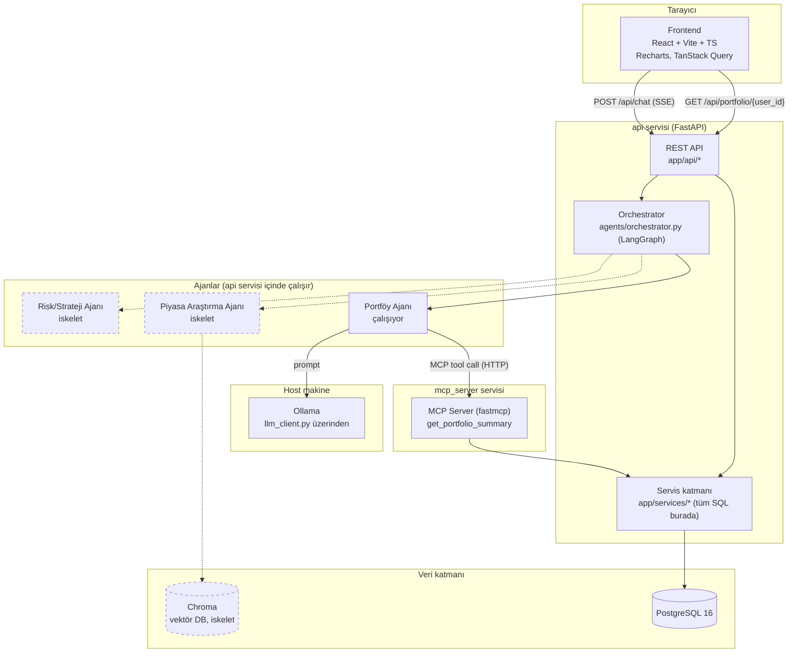
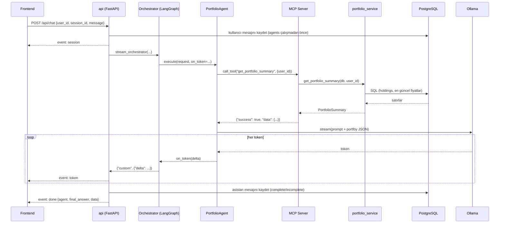

# Mimari

## Bileşen diyagramı

Kesikli çizgiler henüz uygulanmamış (iskelet) bileşenleri/bağlantıları gösterir.

## Veri akışı: `POST /api/chat`

## Neden bu şekilde

- **Ajanlar veriye doğrudan erişmez**, sadece MCP Server üzerindeki tool'ları
  çağırır; tool'lar da servis katmanını çağırır. Bu, "sayısal hiçbir değer
  LLM tarafından üretilmez" ilkesini kod seviyesinde zorunlu kılar — LLM'in
  eline hiçbir zaman ham DB erişimi geçmez.
- **`app/services/`** tüm SQL sorgularının tek adresi; hem REST API hem MCP
  tool'u aynı fonksiyonları çağırır, mantık tekrarlanmaz.
- **Orchestrator**, LangGraph'in `stream_mode="custom"` + `writer` enjeksiyonu
  sayesinde hem tek seferlik (`run_orchestrator`) hem stream'li
  (`stream_orchestrator`) çağrıyı aynı graf üzerinden, kod tekrarı olmadan
  destekler.
- **Chroma ve Ollama** ayrı container'lar olarak `docker-compose.yml`'da var
  (Ollama hariç — bkz. [README](../README.md#neden-ayrı-bir-ollama-containerı-yok)),
  ileride farklı vektör DB / LLM sağlayıcılarına geçişi kolaylaştırmak için
  soyutlanmış arayüzler (`rag/vector_store.py`, `app/core/llm_client.py`)
  arkasında saklı.
